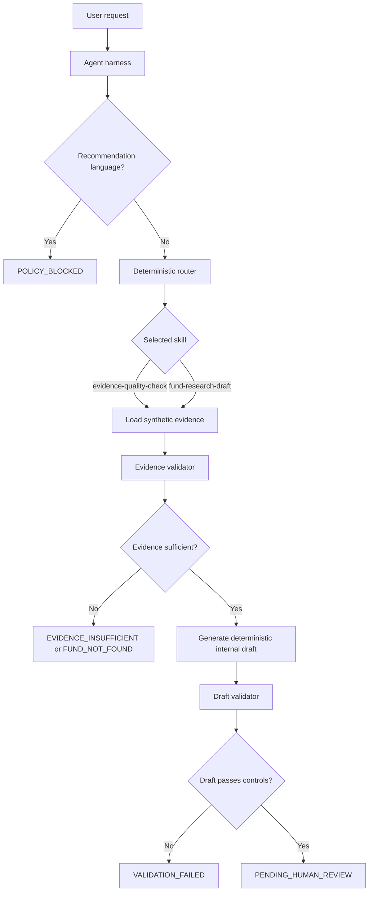

# Governed Asset Management Agent Skills

A compact Python prototype demonstrating how reusable Agent Skills and a
minimal deterministic agent harness can support safe, internal fund-research
preparation.

> **Synthetic data only.** This repository is a portfolio reference
> implementation. It is not a production investment-advice, trading,
> portfolio-management, client-communications, or compliance system.

## Why this project exists

Asset-management teams often spend time locating, checking, and consolidating
approved research information before applying professional judgment. This
prototype demonstrates a narrow, governed workflow that helps prepare internal
research material while maintaining evidence boundaries and human accountability.

The system does not make investment decisions. It checks synthetic evidence,
creates an internal research-preparation draft only when evidence is sufficient,
and routes every valid draft to human review.

## What it demonstrates

- Reusable Agent Skills packaged as folders centered on `SKILL.md`
- Lightweight metadata discovery before detailed skill instructions are used
- A small deterministic agent harness and request router
- Controlled retrieval from a local synthetic evidence store
- Deterministic validation of evidence completeness, package approval, source
  IDs, source approval, and evidence freshness
- Deterministic validation of required report sections, a required disclaimer,
  and prohibited recommendation language
- Mandatory `PENDING_HUMAN_REVIEW` state for every otherwise-valid draft
- Versioned evaluation cases, unit tests, and GitHub Actions CI

## Architecture

## Skills

| Skill | Purpose | Permitted outcome |
|---|---|---|
| `evidence-quality-check` | Validate whether a synthetic fund evidence package is complete, approved, source-traceable, and current enough for internal research preparation | `SUFFICIENT`, `INSUFFICIENT`, or `FUND_NOT_FOUND` |
| `fund-research-draft` | Create a structured internal research draft from sufficient, approved synthetic evidence | `PENDING_HUMAN_REVIEW` only |

Each skill is a self-contained folder with a `SKILL.md` file. The skill files
define when the capability should be used, its steps, constraints, output
requirements, and escalation behavior. The Python harness provides the
deterministic control layer.

## Control model

The key design principle is:

> `SKILL.md` guides agent behavior. Deterministic Python code enforces system behavior.

| Requirement | Agent instruction | Deterministic enforcement |
|---|---|---|
| Use approved evidence only | Skill tells the workflow to use approved synthetic evidence | Evidence validator checks package and source approval fields |
| Do not proceed with missing evidence | Skill requires evidence-quality validation before drafting | Draft workflow blocks unless evidence result is `SUFFICIENT` |
| Include required report sections | Skill requires market exposure, allocation, risks, sources, and disclaimer | Draft validator checks for every required heading and disclaimer |
| Do not make investment recommendations | Skill prohibits recommendation language | Request and draft validators block prohibited terms such as `buy`, `sell`, and `hold` |
| Require human review | Skill requires escalation to review | Valid workflow output is hard-coded to `PENDING_HUMAN_REVIEW` |
| Do not publish or distribute output | Skill prohibits external use | No publish, email, client-delivery, trading, or portfolio-action capability exists |

The prohibited-language list is intentionally small and illustrative. It is not
a substitute for a complete compliance-control framework.

## Synthetic data

The repository contains two fictional funds in `data/synthetic_funds.json`.

| Fund | Purpose | Expected outcome |
|---|---|---|
| `Northstar Global Equity Fund` | Complete approved evidence package for the safe path | `SUFFICIENT`, then `PENDING_HUMAN_REVIEW` for an internal draft |
| `Summit Private Credit Fund` | Intentionally incomplete and stale evidence package | `EVIDENCE_INSUFFICIENT`; no draft is cre